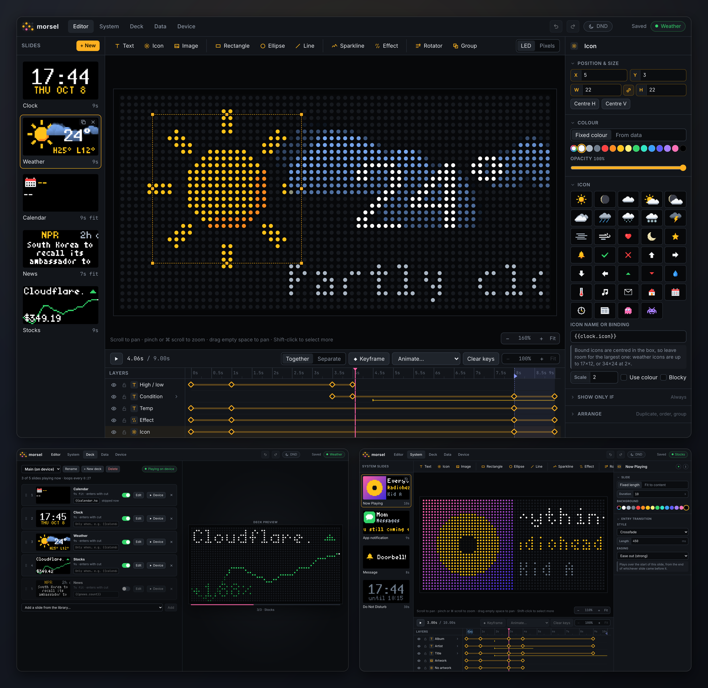

# morsel

Design animated slides for your Tidbyt, bind them to live data, and serve them to the display
from your own machine. morsel is a visual editor and server for any Tidbyt running the community
[tronbyt firmware](https://github.com/tronbyt/firmware-esp32).

**[benphelps.github.io/morsel](https://benphelps.github.io/morsel/)** · [Elements guide](https://benphelps.github.io/morsel/guide.html)



## Highlights

- **A real animation editor.** Keyframes with easing on a timeline, separate tracks for position,
  size, colour and opacity, and transitions between slides. A slide can be a fixed length or fit
  itself to its content: an In, a Hold that lasts as long as the data needs, then an Out.
- **Live data everywhere.** Bind text, colours, icons and images to the clock, weather, news,
  Google News, stocks, crypto, Home Assistant, your Mac's calendar or any JSON API, e.g.
  `{{weather.temp|round}}°`. Pick fields from a searchable list instead of typing paths.
- **Elements that move.** Scrolling and rolling text, sparklines, rotators that cycle through a
  list, weather effects (rain, snow, stars, drifting clouds, overcast skies) and icons, including a
  moon that shows its real phase.
- **What you see is what the panel shows.** One renderer drives the editor and the device, and the
  Device tab mirrors the panel live.
- **Decks and interrupts.** Play slides only when their data says so, push notifications over
  HTTP, pause on Do Not Disturb, and dim at night.
- **A Mac menu bar app** that forwards macOS notifications, shows what's playing in Music, and sends
  your calendar.

The [elements guide](https://benphelps.github.io/morsel/guide.html) covers every element, how
animation and timing work, and how the pieces combine.

## Run it

With Docker:

```bash
echo "PUBLIC_HOST=192.168.1.20" > .env   # this machine's LAN address
docker compose up -d --build
```

Open `http://<host>:8000`. A new project starts with a starter deck (clock, weather, stocks, news
and your next meeting); set a place for the weather in the Data tab. Your project lives in `./data`.

For development:

```bash
npm install
npm run dev   # server on :8000, editor on :5180 with hot reload
npm test
```

## Connect the Tidbyt

Set the firmware's image URL (`REMOTE_URL` in `secrets.json`, or the setup page at
`http://10.10.0.1`) to:

```
ws://<host>:8000/device/ws
```

The Device tab shows the exact address and whether the display is connected.

## Send a notification

```bash
curl -X POST http://<host>:8000/api/notify -H 'content-type: application/json' \
  -d '{"text":"Doorbell!","icon":"bell","durationSec":10}'
```

The deck picks up where it left off afterwards. How notifications look is up to you: they're
system slides, designed in the editor like any other.

## Mac app

`mac/` holds a SwiftUI menu bar app (macOS 14+). Build and install it with Xcode and
[XcodeGen](https://github.com/yonaskolb/XcodeGen):

```bash
mac/install.sh
```

Forwarding notifications needs Full Disk Access, which the app walks you through. Add
`MORSEL_TEAM=<your Apple team ID>` to `.env` to sign with your team, so permissions survive rebuilds.

## Extending

- **Data sources:** add a plugin in `src/server/plugins/` (see `weather.ts`) and register it in
  `index.ts`. The editor builds its settings and field list from the plugin's metadata.
- **Element types:** add a folder in `src/elements/` (see `line/` for the smallest) with the shared
  definition and drawing in `element.ts` and its inspector panel in `Panel.tsx`, then register them
  in `src/elements/index.ts` and `src/elements/editors.ts`.
- **Fonts:** see [fonts/README.md](fonts/README.md).

## Licence

Free for personal, hobby and other noncommercial use under the
[PolyForm Noncommercial License 1.0.0](LICENSE.md); it can't be sold or used commercially. The
bundled fonts keep their own licences ([fonts/README.md](fonts/README.md)).
